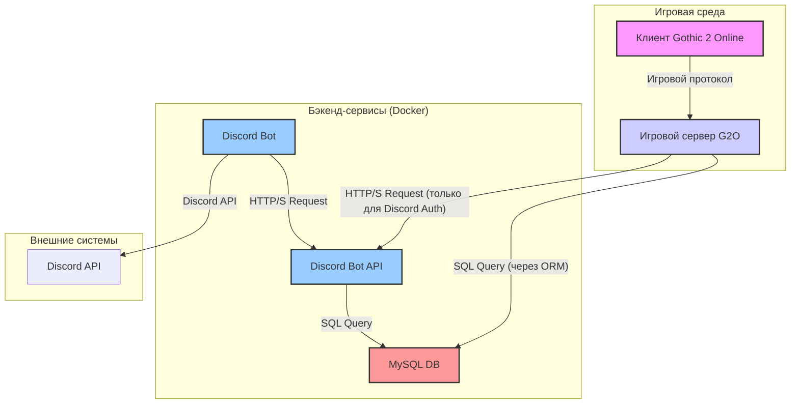

# Архитектура системы

Этот документ описывает высокоуровневую архитектуру (High-Level Design) проекта.

## 1. Диаграмма компонентов (HLD)

Диаграмма ниже иллюстрирует основные компоненты системы и их взаимодействие.

## 2. Описание компонентов

*   **Клиент Gothic 2 Online (G2O_Client):** Игровой клиент, на котором пользователи играют. Взаимодействует только с игровым сервером.
*   **Игровой сервер G2O (G2O_Server):** Основа игрового мода. Обрабатывает всю игровую логику на языке Squirrel. **Напрямую взаимодействует с базой данных** через встроенный ORM-модуль для всех игровых операций (сохранение персонажей, инвентаря, логов и т.д.). Для процесса аутентификации через Discord он также выступает в роли клиента для Discord Bot API.
*   **Discord Bot API:** Сервер-посредник, который предоставляет HTTP-интерфейс, используемый игровым сервером **только для аутентификации через Discord**. Он инкапсулирует логику работы с сессиями аутентификации.
*   **Discord Bot:** Бот, который "живет" в Discord. Он обрабатывает slash-команды от пользователей и общается с Discord Bot API для выполнения их запросов.
*   **База данных (MySQL DB):** Центральное хранилище данных. Хранит всю информацию об аккаунтах, персонажах, игровом мире, логах, а также сессиях аутентификации.
*   **Discord API:** Внешний сервис, с которым взаимодействует Discord-бот для отправки сообщений и регистрации команд.

