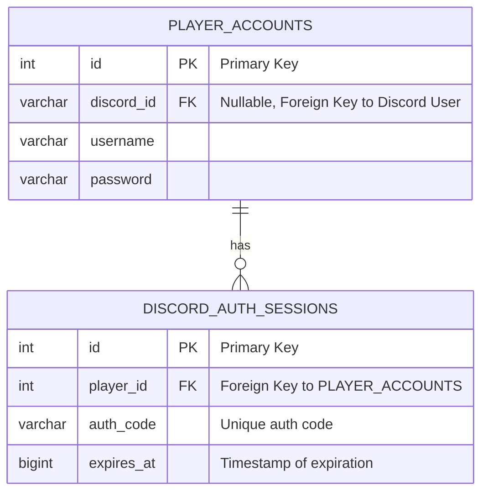

# Модель данных

Этот документ описывает структуру данных, используемых в системе, и отношения между сущностями.

## 1. ER-диаграмма 

Диаграмма ниже представляет основные сущности базы данных и связи между ними.

## 2. Описание таблиц

### `player_accounts`

Хранит основную информацию об игровых аккаунтах.

| Поле | Тип | Описание | Ключ |
|---|---|---|---|
| `id` | INTEGER | Уникальный идентификатор аккаунта | PK |
| `discord_id` | VARCHAR | Уникальный идентификатор Discord пользователя. Может быть `NULL`, если аккаунт не привязан. | FK (неявный) |
| `username` | VARCHAR | Имя пользователя в игре. | |
| `password` | VARCHAR | Хэш пароля. | |

### `discord_auth_sessions`

Хранит временные сессии для привязки Discord аккаунтов. Запись в этой таблице создается в начале процесса и удаляется (или становится невалидной) после его завершения.

| Поле | Тип | Описание | Ключ |
|---|---|---|---|
| `id` | INTEGER | Уникальный идентификатор сессии. | PK |
| `player_id` | INTEGER | Идентификатор игрового аккаунта, который инициировал сессию. | FK to `player_accounts.id` |
| `auth_code` | VARCHAR(10) | Уникальный, короткоживущий код, который игрок вводит в Discord. | |
| `expires_at` | BIGINT | Unix timestamp, после которого сессия и код становятся недействительными. | |

