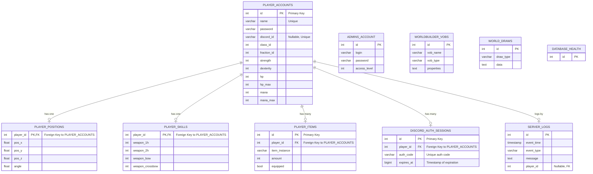

# Модель данных

Этот документ описывает структуру данных, используемых в системе, и отношения между сущностями. 

## 1. ER-диаграмма 

Диаграмма ниже представляет основные сущности базы данных и связи между ними.

## 2. Описание таблиц

### `player_accounts`

Хранит основную и самую обширную информацию об игровых аккаунтах.

| Поле | Тип | Описание |
|---|---|---|
| `id` | INTEGER | Уникальный идентификатор аккаунта (PK) |
| `name` | VARCHAR | Имя пользователя в игре. |
| `password` | VARCHAR | Хэш пароля. |
| `discord_id` | VARCHAR | Уникальный ID Discord пользователя (Nullable). |
| `class_id` | INTEGER | ID класса (ранга) внутри фракции. |
| `fraction_id` | INTEGER | ID фракции. |
| `strength`, `dexterity` | INTEGER | Основные характеристики. |
| `hp`, `hp_max` | INTEGER | Текущее и максимальное здоровье. |
| `mana`, `mana_max` | INTEGER | Текущая и максимальная мана. |
| `learning_points` | INTEGER | Очки обучения. |
| `description` | TEXT | Описание персонажа. |
| `walk_style` | VARCHAR | Стиль ходьбы. |
| `body_model`, `head_model` | VARCHAR | Названия моделей тела и головы. |
| `profession_*` | INTEGER | Множество полей для уровней профессий. |

### `player_positions`

Хранит последнюю известную позицию игрока в мире.

| Поле | Тип | Описание |
|---|---|---|
| `player_id` | INTEGER | Идентификатор игрока (PK, FK to `player_accounts.id`). |
| `pos_x`, `pos_y`, `pos_z` | FLOAT | Координаты в мире. |
| `angle` | FLOAT | Угол поворота персонажа. |

### `player_skills`

Хранит навыки владения оружием.

| Поле | Тип | Описание |
|---|---|---|
| `player_id` | INTEGER | Идентификатор игрока (PK, FK to `player_accounts.id`). |
| `weapon_1h`, `weapon_2h` | INTEGER | Навык владения одноручным и двуручным оружием. |
| `weapon_bow`, `weapon_crossbow` | INTEGER | Навык владения луком и арбалетом. |

### `player_items`

Хранит инвентарь игрока.

| Поле | Тип | Описание |
|---|---|---|
| `id` | INTEGER | Уникальный идентификатор записи (PK). |
| `player_id` | INTEGER | Идентификатор игрока (FK to `player_accounts.id`). |
| `item_instance` | VARCHAR | Имя экземпляра предмета (например, "ITMW_1H_SWORD"). |
| `amount` | INTEGER | Количество предметов в стаке. |
| `equipped` | BOOLEAN | Флаг, показывающий, экипирован ли предмет. |

### `discord_auth_sessions`

Хранит временные сессии для привязки Discord аккаунтов.

| Поле | Тип | Описание |
|---|---|---|
| `id` | INTEGER | Уникальный идентификатор сессии (PK). |
| `player_id` | INTEGER | Идентификатор игрового аккаунта (FK to `player_accounts.id`). |
| `auth_code` | VARCHAR | Уникальный, короткоживущий код. |
| `expires_at` | BIGINT | Unix timestamp, после которого сессия недействительна. |

### `admins_account`

Хранит учетные данные и уровни доступа администрации.

| Поле | Тип | Описание |
|---|---|---|
| `id` | INTEGER | Уникальный идентификатор (PK). |
| `login` | VARCHAR | Логин администратора. |
| `password` | VARCHAR | Хэш пароля. |
| `access_level` | INTEGER | Уровень доступа. |

### `server_logs`

Хранит логи различных событий на сервере.

| Поле | Тип | Описание |
|---|---|---|
| `id` | INTEGER | Уникальный идентификатор записи (PK). |
| `event_time` | TIMESTAMP | Время события. |
| `event_type` | VARCHAR | Тип события (например, 'CHAT', 'CONNECTION', 'ERROR'). |
| `message` | TEXT | Содержание лога. |
| `player_id` | INTEGER | ID игрока, связанного с событием (Nullable, FK to `player_accounts.id`). |

### `worldbuilder_vobs`

Хранит информацию об объектах (VOBs), созданных в редакторе мира.

| Поле | Тип | Описание |
|---|---|---|
| `id` | INTEGER | Уникальный идентификатор объекта (PK). |
| `vob_name` | VARCHAR | Уникальное имя объекта. |
| `vob_type` | VARCHAR | Тип объекта (например, 'oCNpc', 'oCItem'). |
| `properties` | TEXT | JSON-строка со свойствами объекта. |

### `world_draws`

Хранит данные для отрисовки различных элементов в мире (3D тексты, эффекты и т.д.).

| Поле | Тип | Описание |
|---|---|---|
| `id` | INTEGER | Уникальный идентификатор (PK). |
| `draw_type` | VARCHAR | Тип элемента (например, '3D_TEXT', 'EFFECT'). |
| `data` | TEXT | JSON-строка с данными для отрисовки. |

### `Database_Health`

Служебная таблица для проверки доступности и работоспособности базы данных.

| Поле | Тип | Описание |
|---|---|---|
| `id` | INTEGER | Уникальный идентификатор (PK). |
