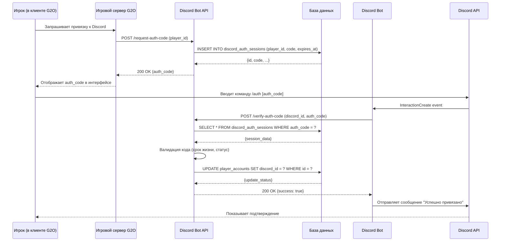

# Диаграммы последовательности 

Этот документ содержит UML-диаграммы последовательности, которые детализируют взаимодействие компонентов в ключевых сценариях.

## 1. Сценарий: Успешная привязка Discord аккаунта

Эта диаграмма показывает шаги, которые выполняются при успешной привязке аккаунта.

